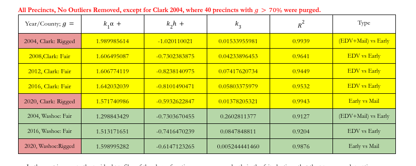

```{r}
xl_list <- list('https://docs.google.com/spreadsheets/d/1xyMQovYh81Wptz-5fyVuLpL4uHrNE78NCDKOVQZ8MyE/edit?usp=sharing', 'https://docs.google.com/spreadsheets/d/1v9-bAI9INnjgfInEJBHNBp4D7N3-Opf4nDKJbzxdBrk/edit?usp=sharing', 'https://docs.google.com/spreadsheets/d/1pzpaOrABQ_9oJK5juubeG_gj4InJpkFzhi5yzxwqf8k/edit?usp=sharing', 'https://docs.google.com/spreadsheets/d/1Gs2Z3eo-ZNO7FZRGXZpgh6J2dJeyryCaMLSbUg3tQig/edit?usp=sharing', 'https://docs.google.com/spreadsheets/d/1DC5zZjoklVgTNExXRTxAIXYcq8_TpVn_WAK03pi6Fpw/edit?usp=sharing', 'https://docs.google.com/spreadsheets/d/1tWgYZcv53teugdQi4WYmNEw0XlIBktrXqka8G6I7TJk/edit?usp=sharing', 'https://docs.google.com/spreadsheets/d/1tAB6sjG7P-0y6PzxyYDvKMbYDK833MgQhfLti5Ip6Gg/edit?usp=sharing', 'https://docs.google.com/spreadsheets/d/1xk8IW9v03i0omZfUo9c75_7wuw9RvE1w8UqUyo1WzAw/edit?usp=sharing')
#Load the required library 
library(googlesheets4)
x <- googlesheets4::read_sheet(xl_list[[3]], sheet=2)
View(x)
```



