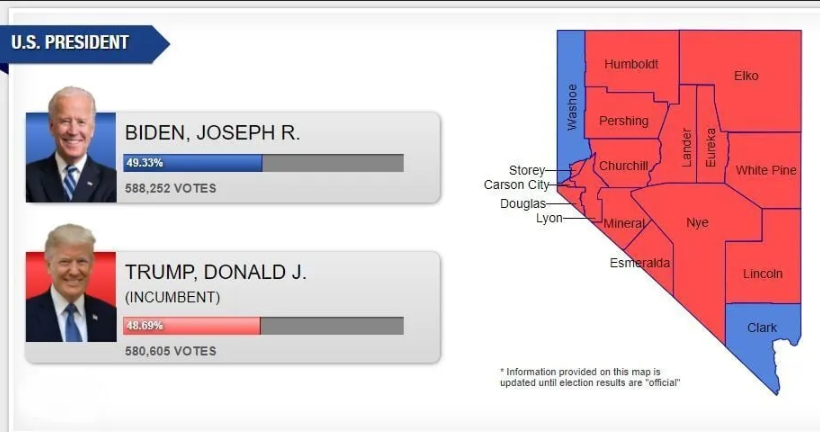

```{r, echo=F, warning=F, message=F}
library(ManifoldDestiny)
library(RefManageR)
library(huxtable)
library(plotly)
xaringanExtra::use_editable(expires = 1)
xaringanExtra::use_tile_view()
xaringanExtra::use_share_again()
xaringanExtra::use_scribble()
xaringanExtra::use_webcam()
xaringanExtra::use_panelset()
modlat <- eqpar$meql
labs <- stickers[['parameters']]
abs_p <- rprojroot::find_rstudio_root_file()
#source(paste0(rprojroot::find_rstudio_root_file(),'/inst/script/addendum_az.R'))
```

```{r, eval=F, echo=F, message=F, warning=F}
pre_fil <- paste0(rprojroot::find_rstudio_root_file(),'/inst/www/addendum/Addendum_ne.Rmd')
xaringan::inf_mr(pre_fil)
#rmarkdown::render(pre_fil) 
```

```{r}
knitr::knit_exit()
```


---
title: "Nevada"
output:
  bookdown::html_document2: default
# https://docs.google.com/document/d/13u3lL_emHyLpog-rFrm7-zk7lKM_AmQd28CJlJ5odFE/edit#
---

```{r}
source(paste0(rprojroot::find_rstudio_root_file(),'/inst/script/addendum_ne.R'))
```


# Introduction



[$50,000 Reward!](https://operationsunlight.com/2022/11/26/50000-reward/)

```{r}
plotly::plot_ly(bindf, x = ~g, y = ~h, z = ~alpha, color = ~tpg,
        type = "scatter3d", mode = "markers")
```


# Main results

# Sideeffects

## Sideeffect #1

```{r}
abc <- allreport(fir$sdfc)
abc[[1]][[2]][[4]]
```

```{r}
abc <- allreport(sec$sdfc)
abc[[1]][[2]][[4]]
```
## Sideeffect #2
## Sideeffect #3
## Sideeffect #4


