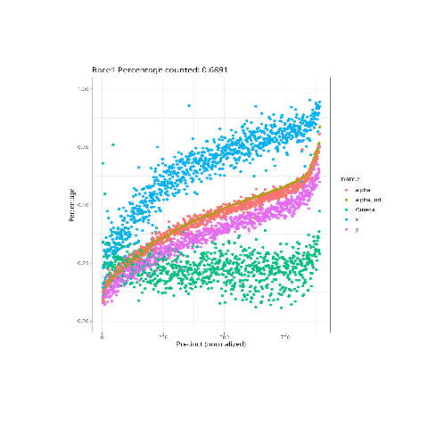

Below are running totals. Dropped is a total of negatives precinct values between each snapshot.

- Before Nov 19, there were only about 2 destroyed ballots that are visible.
Nov 19
  - Batch summary: Attorney General: turnout=247587 ballots=247567 dropped=-427 >***
  - Batch summary: Clerk of the Superior Court: turnout=247587 ballots=244134 dropped=-398 >***
  - Batch summary: County Attorney-Term Expires  DECEMBER 31, 2024: turnout=247587 ballots=247413 dropped=-435 >***
  - Batch summary: Governor: turnout=247587 ballots=247537 dropped=-403 >***
  - Batch summary: Secretary of State: turnout=247587 ballots=247309 dropped=-434 >***
  - Batch summary: State Mine Inspector: turnout=247587 ballots=247168 dropped=-286>***
  - Batch summary: State Treasurer: turnout=247587 ballots=247425 dropped=-434 >***
  - Batch summary: Superintendent of Public Instruction: turnout=247587 ballots=247566 dropped=-424 >***
  - Batch summary: US Rep Dist CD-1: turnout=55004 ballots=54917 dropped=-111 >***
  - Batch summary: US Rep Dist CD-2: turnout=170 ballots=170 dropped=0
  - Batch summary: US Rep Dist CD-3: turnout=23451 ballots=23407 dropped=-1 >***
  - Batch summary: US Rep Dist CD-4: turnout=42700 ballots=42694 dropped=-130 >***
  - Batch summary: US Rep Dist CD-5: turnout=45278 ballots=45272 dropped=-21 >***
  - Batch summary: US Rep Dist CD-7: turnout=4051 ballots=4042 dropped=-3 >***
  - Batch summary: US Rep Dist CD-8: turnout=48148 ballots=48002 dropped=-46 >***
  - Batch summary: US Rep Dist CD-9: turnout=29180 ballots=29143 dropped=-24 >***
  - Batch summary: US Senate: turnout=247982 ballots=247962 dropped=-414 >***

- Nov 21
  - Batch summary: Attorney General: turnout=247675 ballots=247675 dropped=-1076
  - Batch summary: Clerk of the Superior Court: turnout=247675 ballots=244235 dropped=-1028 >***
  - Batch summary: County Attorney-Term Expires  DECEMBER 31, 2024: turnout=247675 ballots=247504 dropped=-1083 >***
  - Batch summary: Governor: turnout=247675 ballots=247675 dropped=-1050
  - Batch summary: Secretary of State: turnout=247675 ballots=247398 dropped=-1084 >***
  - Batch summary: State Mine Inspector: turnout=247675 ballots=247675 dropped=-883
  - Batch summary: State Treasurer: turnout=247675 ballots=247516 dropped=-1082 >***
  - Batch summary: Superintendent of Public Instruction: turnout=247675 ballots=247675 dropped=-1070
  - Batch summary: US Rep Dist CD-1: turnout=55126 ballots=55040 dropped=-117 >***
  - Batch summary: US Rep Dist CD-2: turnout=170 ballots=170 dropped=0
  - Batch summary: US Rep Dist CD-3: turnout=22968 ballots=22927 dropped=-579 >***
  - Batch summary: US Rep Dist CD-4: turnout=42927 ballots=42927 dropped=-133
  - Batch summary: US Rep Dist CD-5: turnout=45297 ballots=45297 dropped=-41
  - Batch summary: US Rep Dist CD-7: turnout=4034 ballots=4025 dropped=-25 >***
  - Batch summary: US Rep Dist CD-8: turnout=48259 ballots=48259 dropped=-52
  - Batch summary: US Rep Dist CD-9: turnout=29289 ballots=29289 dropped=-31
  - Batch summary: US Senate: turnout=248070 ballots=248070 dropped=-1063
